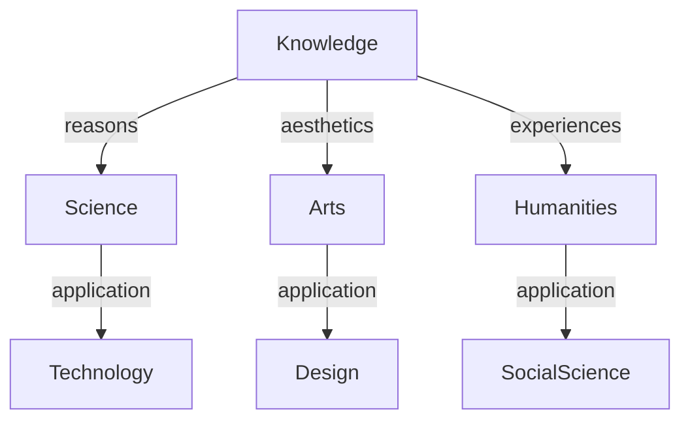

---
{"dg-publish":true,"permalink":"/home/","tags":"gardenEntry","dgHomeLink":true,"dgPassFrontmatter":false}
---

> Welcome to my public note taking experiment! 
---
## *About Me*

I'm Harshit, a product manager by day and content creator by night!
I love **tinkering everything interesting**!

## *Digital notes garden*

This is my attempt to create a non-linear digial notes of **everything** I learn.

1. [[Technology Notes|Technology Notes]]
2. [[Design Notes|Design Notes]]
3. [[Social Science Notes |Social Science Notes ]]

Moreover, to give things a bit order, I am plan to create **syllabus based notes** as well. 

1. [[syllabus/UPSC/UPSC Syllabus|UPSC Syllabus]]
2. [[IGNOU Courses|IGNOU Courses]] 
3. [[NCERT Notes|NCERT Notes]]
---
## *Summary*

In my schema of knowledge, various disciplines are connected to life.

---